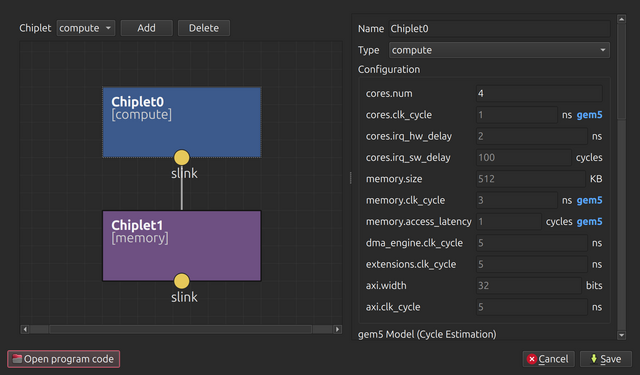

# ChipleX

ChipleX is a high-level simulation environment for chiplet-based systems using SystemC.



There are two ways to use it:

- **[Download the prebuilt application](#download-recommended)** - a single
  executable with the GUI, the simulator, and SystemC bundled in, for Linux
  x86_64 and macOS on Apple Silicon. No SystemC installation required.
  Recommended for most users.
- **[Build from source](#build-from-source)** - for development; requires a local
  SystemC installation.

## Documentation

- [docs/PROGRAM-CODE.md](docs/PROGRAM-CODE.md) - writing setup program code (module entry points, AXI/DMA APIs).
- [docs/CYCLE-ESTIMATION.md](docs/CYCLE-ESTIMATION.md) - estimating per-workload compute time with gem5.
- [docs/RELEASE.md](docs/RELEASE.md) - building a release bundle.

## Download (recommended)

Download the archive for your platform from the project's **Releases** page:

| Platform | Archive |
| --- | --- |
| Linux x86_64 (glibc 2.35+, e.g. Ubuntu 22.04 and later) | `chiplex-linux-x86_64.tar.gz` |
| macOS on Apple Silicon (macOS 12 and later) | `chiplex-macos-arm64.tar.gz` |

Then unpack and run it:

```bash
tar xzf chiplex-<platform>.tar.gz
./chiplex
```

On macOS, a browser-downloaded archive is marked as quarantined, and macOS
refuses to launch the unpacked executable because it is not notarized. Clear the
quarantine flag once, after unpacking:

```bash
xattr -dr com.apple.quarantine ./chiplex
```

The bundle is a self-contained executable. It runs the included setups out of
the box. On first launch it seeds an editable workspace under
`~/.local/share/chiplex/`.

Two optional capabilities depend on tools installed on your machine:

- **Building new or edited setups** requires a C++ compiler and `cmake`.
- **Cycle estimation** requires gem5 and a workload compiler, with LLVM adding
  accelerator speedup (see [Cycle-estimation tools](#cycle-estimation-tools)).
  Without them, setups run with their existing workload cycle counts.

## Build from source

### Prerequisites

Install a C++17 compiler, CMake, and Git, for example:

```bash
sudo apt install build-essential cmake git    # Debian/Ubuntu
sudo dnf install gcc-c++ cmake git            # Fedora
xcode-select --install && brew install cmake  # macOS
```

### SystemC

SystemC is handled automatically: on the first build, the Makefile fetches and
builds a local SystemC 3.0.x into `.systemc-install/` and uses it thereafter.
To use an existing SystemC instead, set
`SYSTEMC_PATH` to its install prefix (containing `include/` and
`lib/libsystemc.so`, or `lib/libsystemc.dylib` on macOS).

## Cycle-estimation tools

Cycle estimation predicts each setup's per-workload compute time so simulated
time advances realistically; see
[docs/CYCLE-ESTIMATION.md](docs/CYCLE-ESTIMATION.md) for how it works. It runs
automatically and is skipped when the tools below are missing, in which case
setups fall back to their existing workload cycle counts. Installing them is
optional but recommended for realistic processing-delay estimates.

Each tool is discovered independently, as described below.

### gem5

- **Used for:** running each workload under a CPU model to measure its cycle count.
- **Found via:** `gem5.opt` on your `PATH`, or the full path in the `GEM5_BIN`
  environment variable. The m5 pseudo-op header and shim are read from the gem5
  source tree: set `GEM5_HOME` to it, or let it be inferred from the binary's
  location.
- **Note:** build gem5 with the ISAs of the CPU models you use (a `build/ALL`
  build covers all of them).
- **Link:** https://gem5.org

### Workload compiler toolchain

- **Used for:** compiling each workload for its CPU model before gem5 runs it.
- **Which toolchain:** this depends on the CPU model, not on gem5. The default
  `riscv-minor` model uses the RISC-V GNU toolchain (`riscv64-unknown-elf-g++`);
  another CPU model may name a different compiler in its manifest.
- **Found via:** the model's compiler on your `PATH`.
- **Link (RISC-V, the default):**
  https://github.com/riscv-collab/riscv-gnu-toolchain

### LLVM (`llvm-mca`)

- **Used for:** modeling accelerator speedup only; plain core cycle estimation
  does not need it.
- **Found via:** `llvm-mca` on your `PATH`.
- **Link:** https://llvm.org

## Usage

### Build

```bash
make [release|debug|asan]
```

The first build also compiles SystemC; later builds reuse it.

### Execute Simulation GUI

```bash
make gui
```

### Execute Simulation CLI

```bash
make run ARGS="--help"
```

### Package a release

Build the self-contained bundle described in [Download](#download-recommended):

```bash
make bundle  # produces dist/chiplex
```

See [docs/RELEASE.md](docs/RELEASE.md) for details and CI.

### Testing

Run every setup and compare its `stats.json` against the committed golden output in
`tests/golden/`:

```bash
make test
```

After an intentional, reviewed behavior change, regenerate the golden files with
`make test-update`.

## License

ChipleX is released under the MIT License; see [LICENSE](LICENSE). Vendored and
bundled third-party components remain under their own licenses, listed in
[THIRD-PARTY.md](THIRD-PARTY.md).